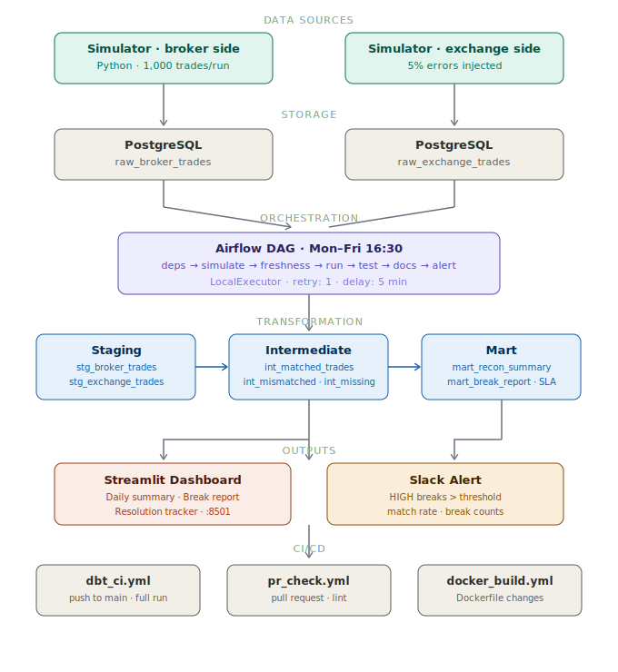
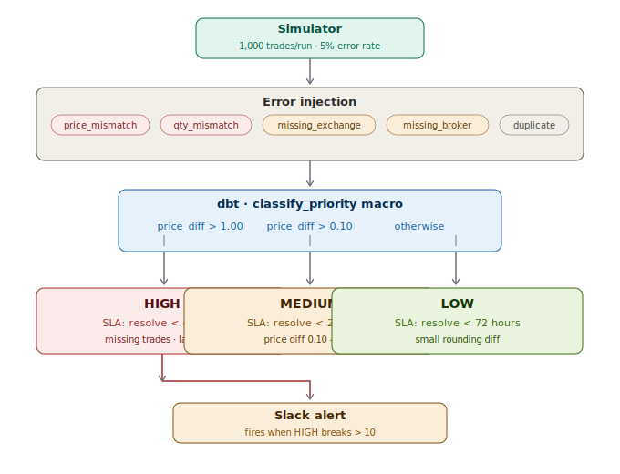
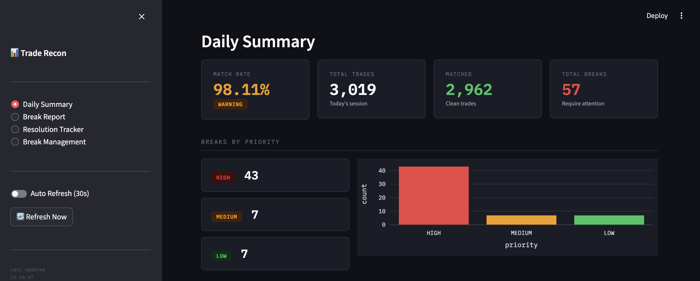
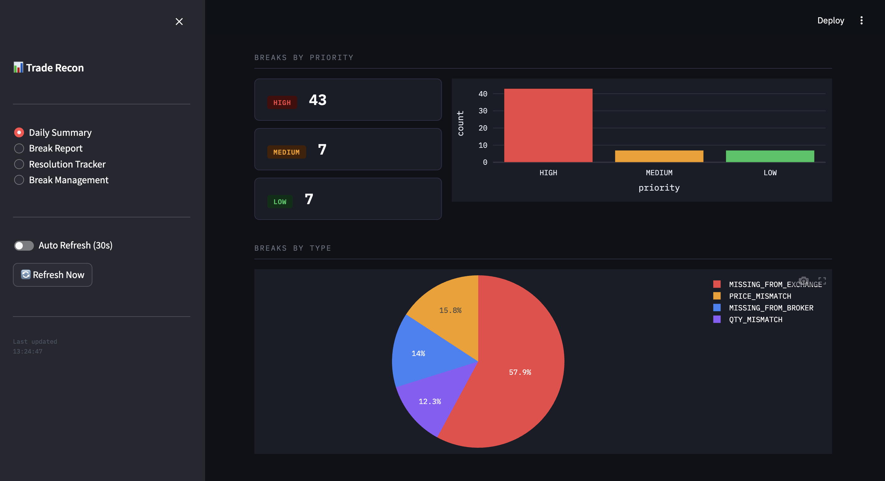
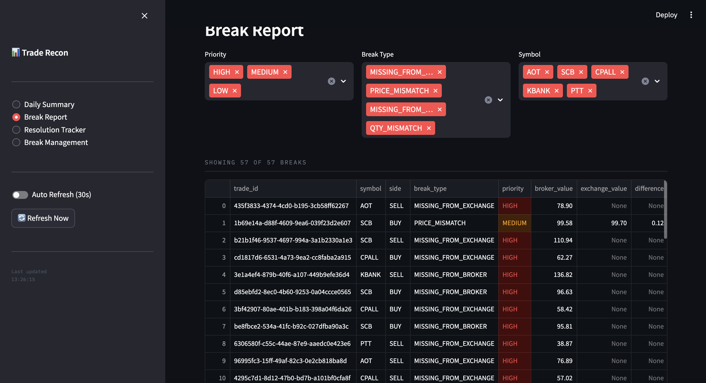
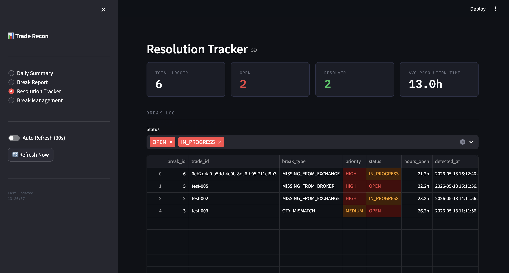
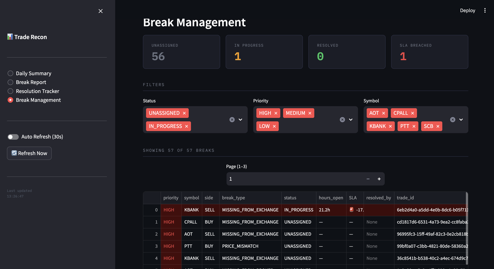
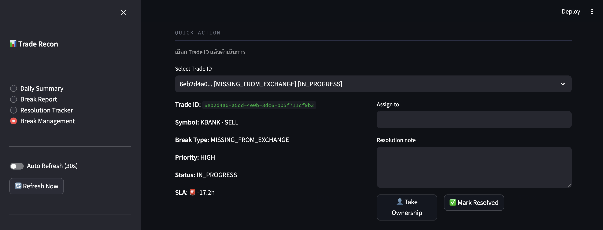
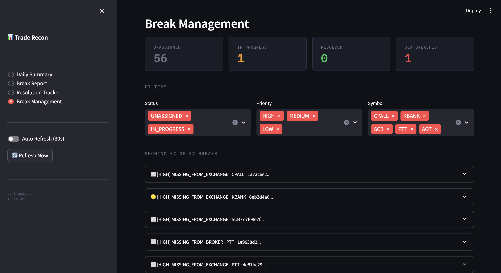
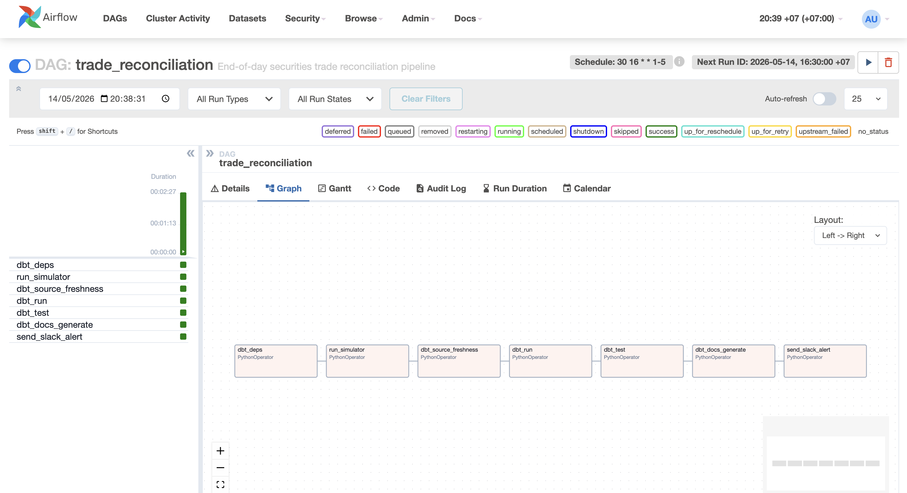

# Trade Reconciliation Pipeline

[](https://github.com/Meuracha/Trade-Reconciliation-Pipeline/actions/workflows/dbt_ci.yml)
[](https://github.com/Meuracha/Trade-Reconciliation-Pipeline/actions/workflows/docker_build.yml)
[](https://meuracha.github.io/Trade-Reconciliation-Pipeline)
[](https://www.python.org/)
[](https://www.getdbt.com/)
[](https://airflow.apache.org/)

End-to-end data engineering pipeline that detects and tracks reconciliation breaks between broker-side and exchange-side trade records — simulating real-world operations at a securities firm.

---

## Architecture



## Data Flow



---

## Tech Stack

| Layer | Tool |
|-------|------|
| Orchestration | Apache Airflow 2.9 |
| Transformation | dbt-core 1.8 + dbt-postgres |
| Storage | PostgreSQL 15 |
| Visualization | Streamlit |
| Containerization | Docker + Docker Compose |
| CI/CD | GitHub Actions |
| SQL Lint | sqlfluff |
| Python Lint | ruff |

---

## Project Structure

```
trade-reconciliation/
├── .github/workflows/
│   ├── dbt_ci.yml            # dbt run + test + docs on push to main
│   ├── dbt_docs.yml          # deploy dbt docs to GitHub Pages
│   ├── pr_check.yml          # dbt compile + sqlfluff + ruff on PR
│   └── docker_build.yml      # Docker build check on Dockerfile changes
├── airflow/
│   ├── Dockerfile
│   ├── requirements.txt
│   └── dags/
│       └── reconciliation_dag.py
├── dashboard/
│   ├── Dockerfile
│   ├── requirements.txt
│   └── app.py                # Streamlit 4-page dashboard
├── dbt/
│   ├── macros/
│   │   └── classify_priority.sql
│   ├── models/
│   │   ├── staging/          # clean + incremental
│   │   ├── intermediate/     # match, mismatch, missing
│   │   ├── mart/             # summary, break report, SLA
│   │   └── exposures.yml
│   └── tests/                # singular tests
├── docs/
│   ├── images/               # architecture + data flow SVG
│   └── screenshots/          # dashboard screenshots
├── postgres/
│   └── init.sql              # auto-creates tables on first start
├── simulator/
│   ├── Dockerfile
│   ├── requirements.txt
│   └── generate_trades.py    # generates trades + injects errors
├── .env.example
├── docker-compose.yml
├── Makefile
└── pyproject.toml
```

---

## dbt Models

### Staging (incremental views)
| Model | Description |
|-------|-------------|
| `stg_broker_trades` | Cleaned broker trades — filters nulls, standardises symbols |
| `stg_exchange_trades` | Cleaned exchange trades — filters nulls, standardises symbols |

### Intermediate (views)
| Model | Description |
|-------|-------------|
| `int_matched_trades` | Trades matching on both sides |
| `int_mismatched_trades` | Trades with price or qty differences + priority classification |
| `int_missing_trades` | Trades existing on one side only |

### Mart (tables)
| Model | Description |
|-------|-------------|
| `mart_reconciliation_summary` | Daily KPIs — match rate, total breaks, status |
| `mart_break_report` | Full break list ordered by priority for Operations team |
| `mart_break_resolution` | SLA tracking — hours open, SLA target, MET/BREACHED |

---

## Dashboard

| Page | Description |
|------|-------------|
| Daily Summary | Match rate %, KPI cards, breaks by priority and type |
| Break Report | Filterable break table with CSV export |
| Resolution Tracker | OPEN/IN_PROGRESS/RESOLVED tracking + SLA chart |
| Break Management | Assign, resolve, escalate breaks with SLA countdown |

### Daily Summary



### Break Report


### Resolution Tracker


### Break Management




### Airflow DAG — All tasks green ✅


---

## Quick Start

### Prerequisites
- Docker + Docker Compose
- Make

### 1. Clone and configure

```bash
git clone https://github.com/your-username/trade-reconciliation.git
cd trade-reconciliation

cp .env.example .env
# Edit .env and fill in your values
```

### 2. Start all services

```bash
make up
```

### 3. Run the pipeline

```bash
make pipeline
```

### 4. Open dashboard

```
Streamlit  → http://localhost:8501
Airflow    → http://localhost:8080  (admin / admin)
dbt Docs   → https://meuracha.github.io/Trade-Reconciliation-Pipeline
```

### 5. View dbt docs

```bash
make dbt-docs
# Opens http://localhost:8080 with lineage graph
```

---

## Makefile Commands

```bash
make up           # Start all services
make down         # Stop all services
make reset        # Reset all volumes and restart fresh
make simulate     # Run simulator once
make dbt-run      # Run all dbt models
make dbt-test     # Run all dbt tests
make dbt-docs     # Generate + serve dbt docs
make pipeline     # simulate → dbt run → dbt test
make lint         # Python lint (ruff)
make dbt-lint     # SQL lint (sqlfluff)
make clean        # Remove dbt artifacts
```

---

## CI/CD

| Workflow | Trigger | What it does |
|----------|---------|--------------|
| `dbt_ci.yml` | Push to main | Full dbt run + test + docs |
| `dbt_docs.yml` | Push to main (dbt changes) | Deploy dbt docs to GitHub Pages |
| `pr_check.yml` | Pull Request | dbt compile + sqlfluff + ruff |
| `docker_build.yml` | Dockerfile changes | Build all images |

### GitHub Secrets required

```
APP_DB_USER
APP_DB_PASSWORD
APP_DB_NAME
```

---

## Design Decisions

**Why two PostgreSQL databases?**
Airflow metadata and application trade data are kept separate to avoid schema conflicts and allow independent scaling.

**Why not auto-fix mismatches?**
In real securities operations, reconciliation breaks must be investigated and resolved by the Operations team — automated fixes on financial data risk introducing errors and violate audit requirements.

**Why incremental models in staging?**
Daily trade volume grows continuously. Incremental materialisation processes only new records since the last run, reducing compute time as data scales.

**Why classify breaks by priority?**
Operations teams need to triage breaks efficiently. Missing trades (HIGH) require immediate action due to settlement risk. Small price rounding differences (LOW) can be batched.

---

## Author

**Uracha Rittikulsittichai**
Data Engineer · KMUTT Computer Engineering
[uracha.rit@gmail.com](mailto:uracha.rit@gmail.com) · [linkedin.com/in/uracha-rit](https://linkedin.com/in/uracha-rit)